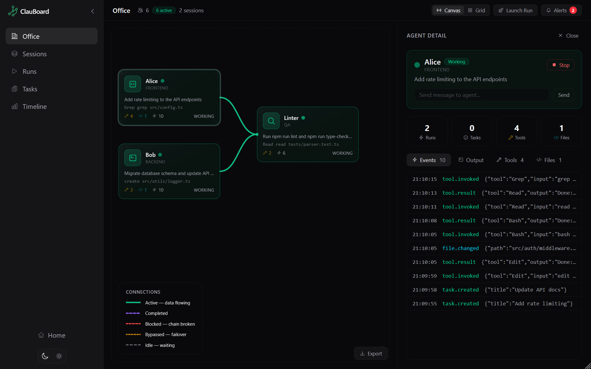

# ClauBoard

[](./LICENSE)

**Visual control plane for [Claude Code](https://docs.anthropic.com/en/docs/claude-code) agents.** Launch, monitor, and coordinate multiple AI agents from one screen. Free, open-source, self-hosted.



---

Stop switching between terminals. ClauBoard gives you a real-time dashboard where every agent is a draggable node on a canvas — you see what it's doing, what tools it's calling, what files it's changing, and whether it's blocked. Group agents into pipelines with dependency chains, send follow-up instructions while they work, and export everything when you're done.

All state is derived from an append-only event stream. The UI is a projection — never the source of truth.

## Features

| Category | What you get |
|----------|-------------|
| **Canvas** | Draggable agent nodes with live connection lines (green = active, purple = done, red = blocked, amber = failover) |
| **Pipelines** | Chain agents with dependencies — parallel or staged. Presets included |
| **Live events** | Every tool call, file edit, and terminal output streams via WebSocket |
| **Interactive** | Send follow-up messages to running agents from the detail panel |
| **Context sharing** | Dependent agents receive a summary of upstream work automatically |
| **Failover** | If an upstream agent fails, dependents still launch with a warning |
| **Notifications** | Built-in alert rules for failures, blocks, tool errors, and long runs |
| **Plugins** | Extend with custom event types, notification rules, and lifecycle hooks |
| **Storage** | JSONL (default) or SQLite with WAL mode. Event archival and auto-compact |
| **Docker** | Multi-stage build, docker-compose with mock profile. One command to deploy |
| **Themes** | Light/dark toggle with flash-free persistence |

## Who it's for

Developers running 1–10 Claude Code agents who want one place to see what's happening, intervene when needed, and review what happened after.

## Quick start

```bash
git clone https://github.com/Sipoke123/ClauBoard.git
cd ClauBoard
npm install
```

**Mock mode** — no Claude CLI needed, six demo agents with realistic events:

```bash
npm run dev:mock
```

**Real mode** — launch actual Claude Code agents from the UI:

```bash
npm run dev
```

Open [http://localhost:3000](http://localhost:3000). Click **Try it Now** to enter the dashboard.

> Requires Node.js >= 20. Real mode requires [Claude Code CLI](https://docs.anthropic.com/en/docs/claude-code) installed and authenticated.

## Usage

### Single agent

Open `/office` → **Launch Run** → pick a preset or type a prompt. The agent appears on the canvas and updates live. Click it to inspect events, output, tools, and files.

### Pipeline

**Launch Run** → **Pipeline** tab → pick a preset. Agents appear with dependency connections. Parallel agents run simultaneously; dependents wait for prerequisites.

```
Frontend ────┐
Backend  ────┼──→ Code Review ──→ Deploy
Database ────┘
```

### Interactive messaging

While an agent works, type a message in the detail panel and press Send. It's piped to the agent's stdin and appears in the event stream as `[operator]`.

### Pages

| Path | Purpose |
|------|---------|
| `/office` | Canvas dashboard with draggable nodes and grid view |
| `/sessions` | Session management with pipeline visualization |
| `/runs` | Run history with virtual scrolling |
| `/tasks` | Task board (Pending / In Progress / Completed / Failed) |
| `/timeline` | Full event timeline across all agents |

## Configuration

All config via environment variables or CLI flags.

| Variable | Default | Description |
|----------|---------|-------------|
| `PORT` | `3001` | Server port |
| `STORAGE` | `jsonl` | `jsonl` or `sqlite` |
| `MOCK_AGENTS` | `false` | Start with demo agents |
| `ALLOWED_WORKSPACE_ROOTS` | _(empty)_ | Restrict agent working directories |
| `AUTO_COMPACT` | `0` | Auto-compact event threshold (0 = off) |
| `DATA_DIR` | `./data` | Persistence directory |

**SQLite storage:**

```bash
STORAGE=sqlite npm run dev
```

**Workspace restrictions:**

```bash
ALLOWED_WORKSPACE_ROOTS=/home/user/projects,/tmp/sandbox npm run dev
```

**Docker:**

```bash
docker compose up                        # real mode
docker compose --profile mock up         # mock mode
STORAGE=sqlite docker compose up -d      # detached with SQLite
```

## Architecture

```
apps/web/            Next.js 15 operator UI (port 3000)
apps/server/         Express + WebSocket server (port 3001)
packages/shared/     TypeScript types, API contracts, WS messages
```

- **Event-sourced** — 16 typed event types, append-only, replayable
- **Adapter pattern** — `AgentAdapter` interface with `start(emit)` and `stop()`
- **Real-time** — WebSocket pushes events and debounced snapshots
- **Virtual scrolling** — `@tanstack/react-virtual` handles 50,000+ rows
- **Plugin system** — custom event types, notification rules, lifecycle hooks

See [docs/architecture.md](docs/architecture.md) for the full design.

## Limitations

- **Local only** — no auth, no multi-user. Runs on localhost
- **Trusted environment** — uses `--dangerously-skip-permissions` for non-interactive runs
- **File detection is best-effort** — catches Edit/Write but may miss Bash file changes

## Documentation

| Document | Contents |
|----------|----------|
| [Architecture](docs/architecture.md) | System design and data flow |
| [Event model](docs/event-model.md) | 16 event types, persistence, replay |
| [Backend](docs/backend-architecture.md) | Server internals, adapter layer |
| [Frontend](docs/frontend-ia.md) | UI structure and state management |
| [Claude Code adapter](docs/claude-code-adapter.md) | Real agent integration |
| [Demo guide](docs/demo-guide.md) | Step-by-step demo scenarios |
| [Roadmap](docs/roadmap.md) | What's done, what's next |

## Contributing

Contributions welcome. Fork, branch, make changes, run `npm run type-check && npm run lint`, open a PR. Keep diffs small. For large changes, open an issue first.

## License

[AGPL-3.0](./LICENSE). Commercial licensing available — contact via [GitHub](https://github.com/Sipoke123/ClauBoard).

Copyright (c) 2026 ClauBoard
